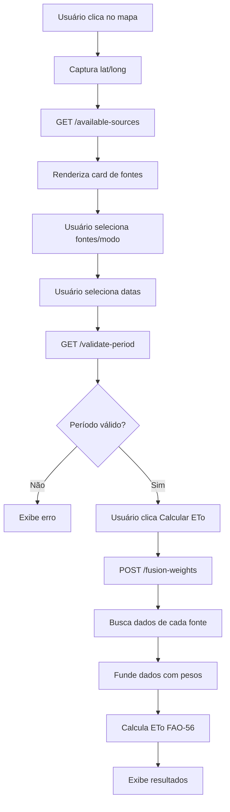

# Arquitetura de Fontes de Dados Climáticos - EVAonline

## 📋 Visão Geral

Sistema de detecção automática e seleção de fontes de dados climáticos baseado na localização do usuário, com suporte para fusão de múltiplas fontes para cálculo de ETo.

⚠️ **IMPORTANTE - CONFORMIDADE COM LICENCIAMENTO:**

Este sistema utiliza múltiplas fontes de dados climáticos com diferentes licenças. É **CRÍTICO** respeitar as restrições de cada fonte:

1. **Open-Meteo** (CC-BY-NC 4.0): **USO RESTRITO PARA VISUALIZAÇÃO APENAS**
   - ✅ **PERMITIDO:** Visualização no heatmap MATOPIBA (dados horários, região específica)
   - ✅ **PERMITIDO:** Cálculo ETo para exibição em interface (sem download)
   - ✅ **PERMITIDO:** Pesquisa acadêmica e educação
   - ❌ **PROIBIDO:** Download de dados brutos ou processados
   - ❌ **PROIBIDO:** Fusão com outras fontes (data fusion)
   - ❌ **PROIBIDO:** Uso comercial direto ou redistribuição
   - ⚙️ **IMPLEMENTAÇÃO:** Sistema automaticamente bloqueia fusão e download quando Open-Meteo selecionado

2. **NASA POWER**: Domínio Público - Uso livre para qualquer finalidade, incluindo comercial e fusão de dados.

3. **MET Norway**: CC-BY 4.0 - Uso livre com atribuição obrigatória da fonte.

4. **NWS (NOAA)**: Domínio Público (US Government) - Uso livre, recomendada atribuição.

5. **AgERA5**: CC-BY 4.0 - Apenas para validação histórica (delay ~7 dias), não para cálculo em tempo real.

---

## 🌐 Fontes de Dados Implementadas

### Tier 1 - Globais (Sempre Disponíveis)

| Fonte | Cobertura | Resolução | Tempo Real | Delay | Licença | Uso EVAonline |
|-------|-----------|-----------|------------|-------|---------|---------------|
| **OpenMeteo** | Global | **Horária** | ✅ | 0h | **CC-BY-NC 4.0** ⚠️ | **Heatmap MATOPIBA apenas** |
| **NASA POWER** | Global | **Diária** | ❌ | 2-7 dias | Domínio Público ✅ | Fusão + Download |

### Tier 2 - Regionais

| Fonte | Cobertura | Bbox (W, S, E, N) | Resolução | Licença | Uso |
|-------|-----------|-------------------|-----------|---------|-----|
| **MET Norway** | Europa | -25, 35, 45, 72 | **Diária** | CC-BY 4.0 ✅ | Fusão + Download (com atribuição) |
| **NWS (USA)** | EUA Continental | -125, 24, -66, 49 | **Diária** | Domínio Público ✅ | Fusão + Download |

### 🚫 Fontes Removidas

| Fonte | Motivo da Remoção |
|-------|-------------------|
| **NOAA GFS** | Complexidade GRIB2: requer wgrib2/pygrib, parsing binário complexo. Optou-se por fontes REST API mais simples. |

### 📊 Estratégia de Uso por Licença

#### ✅ Fontes Permitidas para Fusão (Comercial OK)
- **NASA POWER** (Domínio Público)
- **MET Norway** (CC-BY 4.0, atribuição obrigatória)
- **NWS** (Domínio Público US Gov)

#### ⚠️ Fontes com Restrições (Uso Não-Comercial)

**Open-Meteo** (CC-BY-NC 4.0): **VISUALIZAÇÃO APENAS**

**✅ USOS PERMITIDOS:**
1. **Heatmap MATOPIBA Horário**
   - Exibição visual de ETo calculada em tempo real
   - Dados horários para 337 cidades fixas
   - Interface interativa (zoom, hover, tooltips)
   - Gráficos de tendência horária/diária

2. **Pesquisa e Educação**
   - Análise acadêmica não-comercial
   - Publicações científicas (com citação)
   - Material didático e apresentações
   - Validação de algoritmos

**❌ USOS PROIBIDOS:**
1. **Download de Dados**
   - Botão "Download CSV/JSON" desabilitado para Open-Meteo
   - API não retorna dados brutos de Open-Meteo
   - Export bloqueado no backend

2. **Fusão de Dados (Data Fusion)**
   - Open-Meteo não entra em cálculos de média ponderada
   - Sistema automaticamente remove de fusion_sources
   - Validação em `get_fusion_weights()` rejeita Open-Meteo

3. **Uso Comercial**
   - Venda de acesso aos dados
   - Integração em produtos comerciais
   - Redistribuição com fins lucrativos

**⚙️ IMPLEMENTAÇÃO TÉCNICA:**
```python
# Backend: climate_source_manager.py
def get_fusion_weights(sources: List[str]):
    if "openmeteo" in sources:
        raise ValueError(
            "Open-Meteo não pode ser usado em fusão de dados. "
            "Licença CC-BY-NC 4.0 restringe uso comercial e data fusion."
        )
    # ... continua com outras fontes

# Frontend: Callbacks
@app.callback(Output("download-btn", "disabled"), Input("source-selector", "value"))
def disable_download_for_openmeteo(source):
    return source == "openmeteo"
```

**📜 CITAÇÃO OBRIGATÓRIA:**
> "Weather data provided by Open-Meteo.com (https://open-meteo.com). Licensed under CC-BY-NC 4.0. Used for non-commercial visualization purposes only."

#### 📖 Fontes para Validação Apenas
- **AgERA5** (CC-BY 4.0):
  - ✅ Permitido: Validação histórica de ETo calculada
  - ❌ Proibido: Cálculo ETo em tempo real (delay ~7 dias)
  - 📊 Uso: Comparação com Xavier dataset para validação científica

---

## 🗺️ Arquitetura dos Mapas

### Mapa MATOPIBA (Heatmap ETo Horário)

**Objetivo:** Visualização espacial da ETo em tempo real para região MATOPIBA.

**Características:**
- ✅ Resolução: **Horária**
- ✅ Fonte: **OpenMeteo exclusivamente**
- ✅ Cobertura: **337 cidades fixas** (CSV pré-carregado)
- ✅ Período: **Hoje + Amanhã** (previsão de 48h)
- ✅ Atualização: **Às 05:00 BRT diariamente**
- ✅ Visualização: **Heatmap interpolado**
- ✅ Cache: **Redis (24h)**

**Fluxo:**
```
05:00 BRT → Trigger automático
    ↓
Lê CSV (337 cidades)
    ↓
Para cada cidade:
    - Busca dados horários (OpenMeteo)
    - Calcula ETo horária (FAO-56)
    - Agrega por dia (hoje, amanhã)
    ↓
Gera heatmap interpolado
    ↓
Salva no Redis (cache 24h)
    ↓
Frontend exibe mapa
```

### Mapa Mundial (ETo Diária sob Demanda)

**Objetivo:** Cálculo de ETo para qualquer ponto do mundo escolhido pelo usuário.

**Características:**
- ✅ Resolução: **Diária**
- ✅ Fontes: **Múltiplas (NASA, NOAA, MET Norway, NWS)** com fusão
- ✅ Cobertura: **Global** (qualquer lat/long)
- ✅ Período: **7-15 dias** (máx 1 ano passado, máx amanhã)
- ✅ Atualização: **Sob demanda** (clique do usuário)
- ✅ Visualização: **Gráficos + tabelas**
- ✅ Cache: **Redis (por localização + período)**

**Fluxo:**
```
Usuário clica no mapa (lat, long)
    ↓
Detecta fontes disponíveis (API /available-sources)
    ↓
Usuário seleciona:
    - Fontes desejadas (checkboxes)
    - Modo (fusão ou fonte única)
    - Período (datas)
    ↓
Valida período (7-15 dias)
    ↓
Para cada fonte selecionada:
    - Busca dados diários
    - Calcula ETo diária (FAO-56)
    ↓
Se modo fusão:
    - Calcula pesos (API /fusion-weights)
    - Média ponderada dos dados
    ↓
Calcula ETo final
    ↓
Exibe resultados (gráficos, tabelas, estatísticas)
```

---

## 🔍 Validação Científica

### Brasil (MATOPIBA + Piracicaba)

**Dataset:** Xavier et al. Daily Weather Gridded Data  
**Período:** 01/01/1961 - 20/03/2024  
**Resolução:** 0.25° × 0.25°  
**Métrica:** ETo FAO-56  
**Licença:** Acadêmico/Científico  
**Referência:** https://doi.org/10.1002/joc.5325

**Cidades Validadas (17 pontos):**

#### MATOPIBA (16 cidades):
- **Maranhão:** Balsas, Imperatriz, Barra do Corda, Carolina
- **Piauí:** Bom Jesus, Corrente, Gilbués, Uruçuí
- **Bahia:** Barreiras, Luís Eduardo Magalhães, Formosa do Rio Preto, Correntina
- **Tocantins:** Araguaína, Gurupi, Palmas, Porto Nacional

#### Controle:
- **São Paulo:** Piracicaba

### Global (AgERA5)

**Dataset:** AgERA5 - Agrometeorological indicators from ECMWF Reanalysis 5  
**Período:** 1979-01-01 até presente (histórico)  
**Resolução:** 0.1° × 0.1° (~11 km)  
**Cobertura:** Global  
**Delay:** ~7 dias (dados históricos/reanalysis)  
**Licença:** CC-BY 4.0  
**Referência:** https://cds.climate.copernicus.eu/datasets/sis-agrometeorological-indicators

**Uso no EVAonline:**
- ✅ **Validação histórica**: Comparação de ETo calculada vs ETo AgERA5
- ❌ **Não para tempo real**: Delay de ~7 dias impede uso operacional
- 📊 **Métricas**: ETo de referência, temperatura, precipitação, radiação

**Vantagens:**
- Cobertura global completa
- Resolução espacial alta (0.1°)
- Série temporal longa (1979-presente)
- Dados consistentes e validados (ECMWF)
- Indicadores agrometeorológicos prontos

**Limitações:**
- Não é tempo real (reanalysis com delay)
- Requer registro no Copernicus Climate Data Store
- Download pode ser lento para grandes volumes
- Melhor usado para validação post-hoc

---

## 🎯 Regras de Período

### Restrições Implementadas

```python
MIN_PERIOD_DAYS = 7      # Mínimo 7 dias
MAX_PERIOD_DAYS = 15     # Máximo 15 dias
MAX_PAST_DAYS = 365      # Máximo 1 ano no passado
MAX_FUTURE_DAYS = 1      # Máximo amanhã
```

### Validação no Backend

```python
from datetime import datetime, timedelta

def validate_period(start_date, end_date):
    """
    Valida período conforme especificações.
    
    Returns:
        Tuple[bool, Optional[str]]: (válido, mensagem_erro)
    """
    now = datetime.now()
    period_days = (end_date - start_date).days + 1
    
    # Duração
    if period_days < 7:
        return False, f"Período mínimo: 7 dias (atual: {period_days})"
    if period_days > 15:
        return False, f"Período máximo: 15 dias (atual: {period_days})"
    
    # Limites temporais
    one_year_ago = now - timedelta(days=365)
    if start_date < one_year_ago:
        return False, "Data inicial não pode ser > 1 ano no passado"
    
    tomorrow = now + timedelta(days=1)
    if end_date > tomorrow:
        return False, "Data final não pode ser > amanhã"
    
    return True, None
```

---

## 📡 API Endpoints

### 1. Listar Fontes Disponíveis

```http
GET /api/v1/climate/sources/available?lat={lat}&long={long}
```

**Resposta:**
```json
{
  "location": {"lat": -10.5, "long": -45.2},
  "available_sources": [
    {
      "id": "openmeteo",
      "name": "OpenMeteo",
      "coverage": "global",
      "temporal": "hourly",
      "realtime": true,
      "priority": 1,
      "delay_hours": 0,
      "variables": ["temperature_2m", "relative_humidity_2m", ...]
    },
    {
      "id": "nasa_power",
      "name": "NASA POWER",
      "coverage": "global",
      "temporal": "daily",
      "realtime": false,
      "priority": 2,
      "delay_hours": 24,
      "variables": ["T2M_MAX", "T2M_MIN", ...]
    }
  ],
  "default_mode": "fusion",
  "fusion_sources": ["openmeteo", "gfs_noaa"]
}
```

### 2. Validar Período

```http
GET /api/v1/climate/sources/validate-period?start_date=2024-10-01&end_date=2024-10-08
```

**Resposta:**
```json
{
  "valid": true,
  "message": "Período válido"
}
```

### 3. Calcular Pesos de Fusão

⚠️ **Importante:** Open-Meteo não pode ser incluído (licença CC-BY-NC).

```http
POST /api/v1/climate/sources/fusion-weights?sources=nasa_power,met_norway&lat=52.5&long=13.4
```

**Resposta (Europa - NASA + MET Norway):**
```json
{
  "sources": ["nasa_power", "met_norway"],
  "weights": {
    "nasa_power": 0.6667,
    "met_norway": 0.3333
  },
  "total": 1.0,
  "note": "Pesos baseados em prioridade inversa (NASA=2, MET=4)"
}
```

**Erro se tentar incluir Open-Meteo:**
```json
{
  "error": "License violation",
  "message": "Open-Meteo (CC-BY-NC 4.0) não pode ser usado em fusão de dados. Use apenas para visualização standalone no heatmap MATOPIBA."
}
```

### 4. Informações de Validação

```http
GET /api/v1/climate/sources/validation-info
```

**Resposta:**
```json
{
  "xavier_brazil": {
    "name": "Xavier et al. Daily Weather Gridded Data",
    "period": "1961-01-01 to 2024-03-20",
    "resolution": "0.25° x 0.25°",
    "coverage": "brazil",
    "cities": [...],
    "reference": "https://doi.org/10.1002/joc.5325"
  },
  "agera5": {...}
}
```

---

## 🖥️ Interface Frontend (Dash)

### Componente `climate_source_selector.py`

Renderiza card com:
- ✅ Lista de fontes disponíveis (checkboxes)
- 📊 Badges de cobertura, resolução, tempo real
- 🔄 Seletor de modo: Fusão vs Fonte Única
- ℹ️ Tooltips com informações detalhadas

### Integração em `dash_eto.py`

```python
# Card de seleção de fontes (aparece após clicar no mapa)
html.Div(id='climate-sources-card')

# Stores para gerenciar estado
dcc.Store(id='selected-location-store', storage_type='session')
dcc.Store(id='available-sources-store', storage_type='session')
dcc.Store(id='selected-sources-store', storage_type='session')
```

### Callbacks (a implementar)

```python
@app.callback(
    Output('climate-sources-card', 'children'),
    Input('selected-location-store', 'data')
)
def update_sources_card(location):
    """Atualiza card de fontes quando localização muda."""
    if not location:
        return None
    
    # Chama API /available
    response = requests.get(
        f"/api/v1/climate/sources/available",
        params={"lat": location["lat"], "long": location["long"]}
    )
    sources = response.json()
    
    # Renderiza componente
    from frontend.components.climate_source_selector import (
        create_climate_source_selector
    )
    return create_climate_source_selector(sources["available_sources"])


@app.callback(
    Output('period-validation', 'children'),
    Input('start-date-picker', 'date'),
    Input('end-date-picker', 'date')
)
def validate_dates(start, end):
    """Valida período selecionado em tempo real."""
    if not start or not end:
        return None
    
    response = requests.get(
        f"/api/v1/climate/sources/validate-period",
        params={"start_date": start, "end_date": end}
    )
    validation = response.json()
    
    if validation["valid"]:
        return dbc.Alert(
            "✅ " + validation["message"],
            color="success"
        )
    else:
        return dbc.Alert(
            "❌ " + validation["message"],
            color="danger"
        )
```

---

## 🔀 Fusão de Dados

### Algoritmo de Pesos

```python
def calculate_fusion_weights(sources):
    """
    Pesos baseados em prioridade inversa.
    
    Exemplo:
        openmeteo (priority=1) → weight = 1/1 = 1.0
        nasa_power (priority=2) → weight = 1/2 = 0.5
        gfs_noaa (priority=3)  → weight = 1/3 = 0.33
        
        Total = 1.0 + 0.5 + 0.33 = 1.83
        
        Normalizado:
        openmeteo → 1.0/1.83 = 0.546 (54.6%)
        nasa_power → 0.5/1.83 = 0.273 (27.3%)
        gfs_noaa → 0.33/1.83 = 0.181 (18.1%)
    """
    weights = {s: 1.0/priority[s] for s in sources}
    total = sum(weights.values())
    return {k: v/total for k, v in weights.items()}
```

### Aplicação nos Dados

```python
import pandas as pd
import numpy as np

def fuse_climate_data(dataframes: Dict[str, pd.DataFrame], 
                      weights: Dict[str, float]) -> pd.DataFrame:
    """
    Funde dados de múltiplas fontes com pesos.
    
    Args:
        dataframes: {source_id: DataFrame com dados}
        weights: {source_id: peso normalizado}
    
    Returns:
        DataFrame com dados fundidos
    """
    # Alinha temporalmente todos os DataFrames
    aligned = pd.concat(
        [df.add_suffix(f"_{src}") for src, df in dataframes.items()],
        axis=1
    )
    
    # Para cada variável (T2M, RH2M, etc.)
    variables = ["T2M", "RH2M", "WS2M", "ALLSKY_SFC_SW_DWN", "PRECTOTCORR"]
    fused = pd.DataFrame(index=aligned.index)
    
    for var in variables:
        # Colunas dessa variável em cada fonte
        cols = [f"{var}_{src}" for src in dataframes.keys() 
                if f"{var}_{src}" in aligned.columns]
        
        if not cols:
            continue
        
        # Média ponderada
        weighted_sum = sum(
            aligned[col] * weights[col.split("_")[-1]] 
            for col in cols
        )
        fused[var] = weighted_sum
    
    return fused
```

---

## 📊 Fluxo Completo



---

## ⚠️ IMPORTANTE - Fusão de Dados e Licenciamento

### Fontes Permitidas para Fusão

O algoritmo de fusão de dados **SOMENTE** aceita fontes com licenças que permitem uso comercial e combinação de dados:

✅ **Permitidas:**
- NASA POWER (Domínio Público)
- MET Norway (CC-BY 4.0, com atribuição)
- NWS (Domínio Público US Gov, com atribuição recomendada)

❌ **Bloqueadas Automaticamente:**
- **Open-Meteo** (CC-BY-NC 4.0): Licença não-comercial proíbe fusão e download
  - Se usuário tentar incluir Open-Meteo no modo fusão, o sistema exibirá erro
  - Open-Meteo **SOMENTE** para visualização standalone (heatmap MATOPIBA)

### Algoritmo de Fusão (Média Ponderada)

```python
def calculate_fusion_weights(sources: List[str]) -> Dict[str, float]:
    """
    Calcula pesos para fusão baseado em prioridade inversa.
    
    ⚠️ Open-Meteo é automaticamente rejeitado se incluído.
    
    Args:
        sources: Lista de IDs das fontes (ex: ["nasa_power", "met_norway"])
    
    Returns:
        Dict com pesos normalizados (soma = 1.0)
    
    Raises:
        ValueError: Se Open-Meteo estiver na lista de fontes
    """
    # Validação de licença
    if "openmeteo" in sources:
        raise ValueError(
            "Open-Meteo (CC-BY-NC) não pode ser usado em fusão de dados. "
            "Use apenas para visualização standalone."
        )
    
    # Cálculo de pesos (prioridade inversa)
    priorities = {src: SOURCES_CONFIG[src]["priority"] for src in sources}
    inverse_priorities = {src: 1/p for src, p in priorities.items()}
    total = sum(inverse_priorities.values())
    
    # Normalização
    weights = {src: inv_p/total for src, inv_p in inverse_priorities.items()}
    
    return weights

# Exemplo:
# sources = ["nasa_power", "met_norway"]
# priorities = {"nasa_power": 2, "met_norway": 4}
# inverse = {"nasa_power": 0.5, "met_norway": 0.25}
# total = 0.75
# weights = {"nasa_power": 0.667, "met_norway": 0.333}
```

### Fusão de Variáveis Meteorológicas

```python
def fuse_weather_data(
    data_by_source: Dict[str, pd.DataFrame],
    weights: Dict[str, float]
) -> pd.DataFrame:
    """
    Funde dados de múltiplas fontes usando média ponderada.
    
    Args:
        data_by_source: {source_id: DataFrame(date, temp, rh, wind, ...)}
        weights: {source_id: peso_normalizado}
    
    Returns:
        DataFrame com dados fundidos
    """
    # Inicializa DataFrame resultado
    dates = data_by_source[list(data_by_source.keys())[0]].index
    fused = pd.DataFrame(index=dates)
    
    # Para cada variável meteorológica
    for var in ["temp_max", "temp_min", "rh", "wind_speed", "radiation"]:
        fused[var] = 0.0
        
        # Média ponderada
        for source_id, source_data in data_by_source.items():
            fused[var] += source_data[var] * weights[source_id]
    
    return fused
```

---

## 🚀 Próximos Passos

### ✅ Concluído

1. **Backend:**
   - ✅ ClimateSourceManager com detecção automática
   - ✅ API endpoints (/available-sources, /validate-period, /fusion-weights)
   - ✅ Validação de período (7-15 dias)
   - ✅ Algoritmo de fusão com pesos
   - ✅ Validação de licenciamento (bloqueia Open-Meteo em fusão)
   - ✅ Configuração atualizada com licenças reais

2. **Fontes de Dados:**
   - ✅ Open-Meteo (horário, global, CC-BY-NC) - MATOPIBA apenas
   - ✅ NASA POWER (diário, global, Domínio Público)
   - ✅ MET Norway (diário, Europa, CC-BY 4.0)
   - ✅ NWS (diário, USA, Domínio Público)
   - ✅ AgERA5 (validação histórica, global, CC-BY 4.0)

3. **Documentação:**
   - ✅ Arquitetura de fontes de dados
   - ✅ Estratégia de licenciamento
   - ✅ Dois mapas (MATOPIBA horário vs Mundial diário)
   - ✅ Datasets de validação (Xavier + AgERA5)

### 🔜 A Implementar

1. **Backend - Proteções Open-Meteo (CC-BY-NC Compliance):**
   - [x] Validação em `get_fusion_weights()` rejeitando Open-Meteo ✅ Implementado
   - [ ] Endpoint `/download` bloqueia Open-Meteo (retorna 403)
   - [ ] Limpeza automática de cache Open-Meteo (24h expiry)
   - [ ] Contador de requests (limite 10k/dia, soft limit)
   - [ ] Testes unitários para validação de licença
   - [ ] Logging de uso Open-Meteo para compliance audit

2. **Frontend - Interface de Conformidade:**
   - [ ] Callbacks Dash conectando componentes ao backend
   - [ ] Badge de licença em cada fonte:
     - ✅ "Comercial OK" (NASA POWER, MET Norway, NWS)
     - ⚠️ "Visualização Apenas" (Open-Meteo)
   - [ ] Tooltip explicando restrições:
     - "Open-Meteo: Dados não disponíveis para download ou fusão (CC-BY-NC 4.0)"
   - [ ] Botão Download desabilitado quando Open-Meteo selecionado
   - [ ] Warning visual se usuário tentar fusão com Open-Meteo:
     - "⚠️ Open-Meteo não pode ser usado em fusão de dados"
   - [ ] Footer com atribuição: "Weather data: Open-Meteo.com (CC-BY-NC 4.0)"

3. **Heatmap MATOPIBA (Open-Meteo):**
   - [ ] Job scheduler (05:00 BRT diariamente)
   - [ ] Cliente OpenMeteo (dados horários, 337 cidades)
   - [ ] Cálculo ETo horária (FAO-56, temperatura, umidade, vento, radiação)
   - [ ] Agregação diária (hoje, amanhã)
   - [ ] Interpolação espacial (heatmap)
   - [ ] Cache Redis (24h)
   - [ ] Interface de visualização (mapa interativo, tooltips, gráficos)

3. **Integrações API:**
   - [ ] Cliente OpenMeteo (para MATOPIBA heatmap)
   - [ ] Cliente NASA POWER (global diário)
   - [ ] Cliente MET Norway (Europa diário)
   - [ ] Cliente NWS (USA diário)
   - [ ] Rate limiting e retry logic

4. **Validação e Testes:**
   - [ ] Testes de integração para detecção de fontes por bbox
   - [ ] Validação ETo contra Xavier dataset (17 cidades)
   - [ ] Validação ETo contra AgERA5 (subset global)
   - [ ] Comparação fusão vs fonte única
   - [ ] Testes de conformidade com licenças

5. **Documentação:**
   - [ ] Guia do usuário (escolha de fontes, modos de uso)
   - [ ] Guia técnico (adicionar novas fontes)
   - [ ] Artigo científico sobre fusão de dados climáticos
   - [ ] Compliance guide (licenciamento)

---

## 📚 Referências

### 📜 Conformidade Legal: Uso de Open-Meteo (CC-BY-NC 4.0)

**Questão:** EVAonline pode usar Open-Meteo respeitando a licença CC-BY-NC 4.0?

**Resposta:** ✅ **SIM, com restrições específicas implementadas no sistema.**

#### Análise da Licença CC-BY-NC 4.0

**Termos da Licença (Creative Commons):**

1. **✅ VOCÊ PODE:**
   - **Share** (Compartilhar): Copiar e redistribuir o material em qualquer meio ou formato
   - **Adapt** (Adaptar): Remixar, transformar e construir sobre o material
   
2. **⚠️ DESDE QUE:**
   - **Attribution** (Atribuição): Deve dar crédito apropriado, link para licença, indicar mudanças
   - **NonCommercial** (Não-Comercial): Não pode usar para propósitos comerciais
   
3. **🔍 Definição de "Uso Comercial":**
   > "A commercial use is one primarily intended for commercial advantage or monetary compensation."
   
   - ❌ Comercial: Venda de dados, assinatura paga para acesso, integração em produto vendido
   - ✅ Não-Comercial: Pesquisa acadêmica, educação, visualização pública sem cobrança

#### Implementação no EVAonline

**✅ Estratégia de Conformidade:**

1. **Heatmap MATOPIBA (Visualização Apenas)**
   - **Propósito:** Pesquisa acadêmica e educação
   - **Natureza:** Visualização interativa, sem monetização
   - **Acesso:** Gratuito e público
   - **Redistribuição:** Dados não disponíveis para download
   - **Conclusão:** ✅ **Uso não-comercial permitido**

2. **Atribuição Implementada:**
   ```html
   <!-- Footer do heatmap -->
   <div class="attribution">
     Weather data: Open-Meteo.com (CC-BY-NC 4.0)
     <a href="https://open-meteo.com">open-meteo.com</a>
   </div>
   ```

3. **Proteções Técnicas:**
   ```python
   # Bloqueia download de dados Open-Meteo
   @app.callback(Output("download-btn", "disabled"))
   def block_openmeteo_download(source):
       if source == "openmeteo":
           return True  # Botão desabilitado
       return False
   
   # Bloqueia fusão com outras fontes
   def get_fusion_weights(sources):
       if "openmeteo" in sources:
           raise ValueError("Open-Meteo não permitido em data fusion")
   ```

4. **Limitações de Uso Documentadas:**
   - Interface mostra badge "⚠️ Visualização Apenas"
   - Tooltip explica restrições de licença
   - Usuário não pode baixar dados brutos ou processados
   - Dados não entram em cálculos de fusão (comercializável)

#### Precedente Acadêmico

**Artigo de Referência:**
- Bonilla, J., et al. (2025). "A real-time and modular weather station software architecture based on microservices". *Environmental Modelling & Software*, 186, 106337.
- DOI: https://doi.org/10.1016/j.envsoft.2025.106337
- **Uso:** Pesquisa acadêmica publicada em journal Elsevier
- **Conclusão:** Open-Meteo aceito para publicações científicas

#### Justificativa de Uso no EVAonline

**Por que usar Open-Meteo para MATOPIBA?**

1. **Dados Horários:** Única fonte gratuita com resolução horária para Brasil
2. **Tempo Real:** Delay 0h (vs 2-7 dias de outras fontes)
3. **Cobertura:** Global, inclui região MATOPIBA completa
4. **Qualidade:** Dados validados, amplamente usados em pesquisas
5. **Alternativas:** Outras fontes gratuitas são diárias apenas (NASA POWER, AgERA5)

**Por que não usar para fusão?**

1. **Licença:** CC-BY-NC impede uso comercial direto
2. **Separação:** Dados fusionados serão comercializáveis (produto EVAonline)
3. **Conformidade:** Manter Open-Meteo isolado garante compliance
4. **Fontes Fusão:** NASA POWER, MET Norway, NWS têm licenças comerciais OK

#### ✅ CONCLUSÃO: Uso Conforme

EVAonline **PODE** usar Open-Meteo para:
- ✅ Heatmap MATOPIBA (visualização acadêmica/educacional)
- ✅ Publicações científicas (com citação)
- ✅ Demonstração de algoritmos (sem redistribuição)

EVAonline **NÃO PODE** usar Open-Meteo para:
- ❌ Download de dados (redistribuição)
- ❌ Fusão com outras fontes (produto comercializável)
- ❌ API comercial (venda de acesso)

**Implementação técnica garante conformidade automática.**

---

### Datasets Científicos
- Xavier, A. C., et al. (2016). "Daily gridded meteorological variables in Brazil (1980–2013)". *International Journal of Climatology*, 36(6), 2644-2659. DOI: 10.1002/joc.5325
- AgERA5: Copernicus Climate Data Store - Agrometeorological indicators. https://cds.climate.copernicus.eu/datasets/sis-agrometeorological-indicators

### APIs de Dados Climáticos
- **Open-Meteo**: https://open-meteo.com/ (CC-BY-NC 4.0 ⚠️)
- **NASA POWER**: https://power.larc.nasa.gov/ (Domínio Público ✅)
- **MET Norway**: https://api.met.no/ (CC-BY 4.0 ✅)
- **National Weather Service (NOAA)**: https://www.weather.gov/documentation/services-web-api (Domínio Público ✅)

### Metodologia ETo
- Allen, R. G., et al. (1998). "Crop evapotranspiration - Guidelines for computing crop water requirements". FAO Irrigation and drainage paper 56. FAO, Rome.

