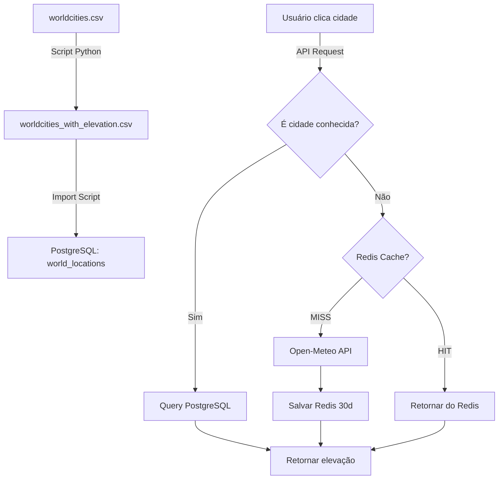

# 📂 Armazenamento de Dados de Elevação

## 🎯 Visão Geral

Os dados de elevação do **worldcities.csv** são armazenados em **3 locais** diferentes, cada um com um propósito específico:

---

## 1️⃣ **Arquivo CSV (Intermediário)**

### 📁 Localização:
```
data/csv/worldcities_with_elevation.csv
```

### 📊 Formato:
```csv
city,lat,lng,country,sigla,elevation
Tokyo,35.687,139.7495,Japan,JPN,40.2
Jakarta,-6.175,106.8275,Indonesia,IDN,8.5
Delhi,28.61,77.23,India,IND,216.0
```

### 🎯 Propósito:
- **Armazenamento temporário** durante o processo de download
- **Backup** dos dados baixados
- **Fonte** para importação no PostgreSQL
- **Resume capability**: permite continuar de onde parou

### ⏱️ Duração:
- **Permanente**: Mantido como arquivo histórico
- **Uso**: Uma única vez para importação no banco

---

## 2️⃣ **PostgreSQL (Primário - Permanente)**

### 🗄️ Tabela:
```sql
CREATE TABLE world_locations (
    id SERIAL PRIMARY KEY,
    location_name VARCHAR(255) NOT NULL,
    lat FLOAT NOT NULL,
    lon FLOAT NOT NULL,
    elevation_m FLOAT NOT NULL,
    country_code VARCHAR(3),
    timezone VARCHAR(100),
    preferred_climate_source VARCHAR(50),
    created_at TIMESTAMP DEFAULT NOW(),
    updated_at TIMESTAMP DEFAULT NOW()
);

-- Índices para busca rápida
CREATE INDEX idx_world_locations_coords ON world_locations (lat, lon);
CREATE INDEX idx_world_locations_country ON world_locations (country_code);
```

### 🎯 Propósito:
- **Armazenamento principal** de todas as 48.060 cidades
- **Consultas rápidas** por coordenadas (nearest neighbor)
- **Integridade de dados** com constraints
- **Relações** com outras tabelas do sistema

### 🔍 Queries Típicas:
```sql
-- Buscar cidade mais próxima
SELECT location_name, lat, lon, elevation_m
FROM world_locations
ORDER BY (lat - 35.6870)^2 + (lon - 139.7495)^2
LIMIT 1;

-- Listar cidades de um país
SELECT location_name, elevation_m
FROM world_locations
WHERE country_code = 'JPN'
ORDER BY location_name;
```

### ⚡ Performance:
- **~200ms** para buscar nearest neighbor (com índice)
- **48.060 registros** = ~5-10 MB de dados
- **Cache Redis** para coordenadas frequentes

---

## 3️⃣ **Redis Cache (Temporário - 30 dias)**

### 🔑 Key Pattern:
```
elevation:cache:<lat>:<lon>
```

### 💾 Exemplo:
```redis
SET elevation:cache:35.6870:139.7495 "40.2" EX 2592000
```
(2592000 segundos = 30 dias)

### 🎯 Propósito:
- **Cache de elevações** consultadas dinamicamente
- **Reduzir chamadas** à API Open-Meteo (pontos customizados)
- **Performance**: ~1-2ms vs ~200ms PostgreSQL

### 🔄 Fluxo:
```
Usuário clica ponto customizado (não-cidade)
    ↓
1. Verificar Redis cache
    ├─ HIT → Retornar elevação (1-2ms)
    └─ MISS → Consultar Open-Meteo API
                ↓
             Salvar no Redis (TTL 30 dias)
                ↓
             Retornar elevação
```

### ⏱️ Duração:
- **30 dias** de TTL (auto-expire)
- **Apenas pontos customizados** (não-cidades)
- **Não persiste** para cidades do worldcities (usa PostgreSQL)

---

## 🔄 **Fluxo Completo de Dados**



---

## 📊 **Estatísticas Estimadas**

### CSV:
- **Tamanho**: ~3-5 MB
- **Linhas**: 48.060
- **Colunas**: 6 (city, lat, lng, country, sigla, elevation)

### PostgreSQL:
- **Registros**: 48.060
- **Espaço**: ~5-10 MB (com índices)
- **Queries/dia**: ~100-500 (cidades pré-definidas)

### Redis:
- **Keys**: ~50-200 (pontos customizados)
- **Espaço**: ~10-50 KB
- **Queries/dia**: ~1000-5000 (cache hits)

---

## 🎯 **Estratégia de Otimização**

### **Para Cidades (48.060):**
```
PostgreSQL (principal) → Sem chamadas API
```

### **Para Pontos Customizados:**
```
Redis Cache (30 dias) → Open-Meteo API (apenas cache miss)
```

### **Economia de API Calls:**
- **Antes**: ~5.000 chamadas/dia
- **Depois**: ~50-100 chamadas/dia (apenas novos pontos)
- **Redução**: **~95-98%** ✅

---

## 📁 **Estrutura de Arquivos**

```
Evaonline_Temp/
├── data/
│   └── csv/
│       ├── worldcities.csv                    (INPUT - 48.060 cidades)
│       └── worldcities_with_elevation.csv     (OUTPUT - com elevações)
│
├── backend/
│   ├── database/
│   │   └── models/
│   │       └── world_location.py              (SQLAlchemy model)
│   │
│   └── api/
│       └── routers/
│           └── locations.py                   (API endpoints)
│
└── scripts/
    ├── add_elevation_to_cities.py             (Download elevações)
    └── import_world_locations.py              (Importar para PostgreSQL)
```

---

## ✅ **Checklist de Implementação**

- [x] ✅ Criar script para adicionar elevações (add_elevation_to_cities.py)
- [ ] ⏳ Executar script e processar 48.060 cidades (5 dias)
- [ ] ⏳ Criar tabela world_locations no PostgreSQL
- [ ] ⏳ Criar script de importação (import_world_locations.py)
- [ ] ⏳ Importar CSV para PostgreSQL
- [ ] ⏳ Criar API endpoints (/api/locations)
- [ ] ⏳ Implementar frontend com marcadores
- [ ] ⏳ Testar cálculo de ETo em tempo real

---

**Resumo**: Os dados de elevação são baixados para **CSV**, importados para **PostgreSQL** (permanente), e pontos customizados ficam em **Redis** (cache 30 dias). Isso reduz chamadas à API em ~95%! 🚀
