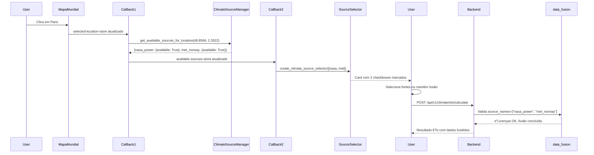

# 🌍 Sistema de Seleção de Fontes para Mapa Mundial

## 📋 Resumo

Implementação completa de um sistema inteligente de seleção de fontes de dados climáticos para o **Mapa Mundial** do EVAonline, com:

✅ **Detecção automática baseada em cobertura geográfica**  
✅ **Exclusão de Open-Meteo (CC-BY-NC 4.0) - restrito ao MATOPIBA**  
✅ **Fusão de dados como comportamento padrão**  
✅ **Validações de licença no backend**  
✅ **Interface com checkboxes para seleção manual**

---

## 🎯 Arquitetura

### **1. Backend: Detecção Geográfica**

**Arquivo:** `backend/api/services/climate_source_manager.py`

#### Novo Método: `get_available_sources_for_location()`

```python
def get_available_sources_for_location(
    self,
    lat: float,
    lon: float,
    exclude_non_commercial: bool = True
) -> Dict[str, Dict]:
    """
    Retorna fontes disponíveis para uma localização específica.
    
    - Verifica cobertura geográfica (bbox intersection)
    - Exclui Open-Meteo automaticamente (non-commercial)
    - Retorna metadados completos (bbox_str, license, can_fuse, etc.)
    """
```

**Funcionalidades:**
- **Validação de bbox:** Verifica se `(lat, lon)` está dentro do bbox de cada fonte
- **Filtro de licença:** Exclui fontes `license: "non_commercial"` quando `exclude_non_commercial=True`
- **Formatação de bbox:** Converte bbox numérico para string legível (ex: `"35°N-72°N, 25°W-45°E"`)
- **Metadados completos:** Retorna `available`, `can_fuse`, `can_download`, `attribution_required`

**Exemplo de uso:**
```python
manager = ClimateSourceManager()
sources = manager.get_available_sources_for_location(
    lat=48.8566,  # Paris
    lon=2.3522
)
# Retorna: nasa_power (global) + met_norway (Europa)
# Exclui: openmeteo (non-commercial), nws_usa (fora bbox)
```

---

### **2. Frontend: Seletor de Fontes**

**Arquivo:** `frontend/components/climate_source_selector.py`

#### Atualizações no `create_climate_source_selector()`

**Novos recursos:**
1. **Filtro de fontes disponíveis:**
   ```python
   active_sources = [
       s for s in available_sources if s.get("available", False)
   ]
   ```

2. **Badge de cobertura com tooltip:**
   ```python
   coverage_tooltip = dbc.Tooltip(
       f"Área de cobertura: {bbox_str}",
       target={"type": "coverage-badge", "source": source["id"]}
   )
   ```

3. **Badges de licença inteligentes:**
   - **Domínio Público:** `✅ Domínio Público` (verde)
   - **CC-BY-4.0:** `✅ Uso Livre` (verde, com "atribuição obrigatória")
   - **CC-BY-NC:** `⚠️ Visualização Apenas` (amarelo, bloqueado para fusão)

4. **Checkboxes padrão marcadas:** Todas as fontes disponíveis selecionadas por padrão (fusão automática)

5. **Tooltips atualizados:**
   - **NASA POWER:** Global, domínio público, livre para fusão/download
   - **MET Norway:** Europa (35°N-72°N, 25°W-45°E), CC-BY 4.0, livre com atribuição
   - **NWS/NOAA:** USA (24°N-49°N, 125°W-66°W), domínio público

---

### **3. Callbacks: Detecção Automática**

**Arquivo:** `frontend/components/climate_callbacks.py`

#### Callback 1: `detect_available_sources`

**Trigger:** Quando usuário clica no mapa mundial (`selected-location-store` atualizado)

**Fluxo:**
```
Usuário clica em Paris
↓
selected-location-store → {"lat": 48.8566, "lon": 2.3522, "name": "Paris"}
↓
detect_available_sources() chama ClimateSourceManager
↓
available-sources-store → {
    "nasa_power": {"available": True, ...},
    "met_norway": {"available": True, ...}
}
```

#### Callback 2: `render_climate_source_selector`

**Trigger:** Quando `available-sources-store` atualizado

**Renderização:**
- Se `sources_data` vazio → Mensagem "Selecione uma localização no mapa"
- Se fontes disponíveis → Renderiza `create_climate_source_selector()` com checkboxes

**Exemplo visual:**
```
┌─────────────────────────────────────────┐
│ 🌐 Fontes de Dados Disponíveis         │
├─────────────────────────────────────────┤
│ ☑ NASA POWER                     Global │
│   Diária  Sim  ✅ Domínio Público       │
│   📍 Cobertura: Global coverage         │
├─────────────────────────────────────────┤
│ ☑ MET Norway                    Europa  │
│   Horária Sim  ✅ Uso Livre             │
│   📍 Cobertura: 35°N-72°N, 25°W-45°E    │
└─────────────────────────────────────────┘
```

---

### **4. Backend: Validação de Licença**

**Arquivo:** `backend/core/data_processing/data_fusion.py`

#### Validação na Função `data_fusion()`

**Novo parâmetro:** `source_names: Optional[List[str]]`

**Lógica de validação:**
```python
blocked_sources = {
    "openmeteo": "Open-Meteo (CC-BY-NC 4.0)",
    "openmeteo_forecast": "Open-Meteo Forecast (CC-BY-NC 4.0)",
    "openmeteo_archive": "Open-Meteo Archive (CC-BY-NC 4.0)"
}

# Verifica se alguma fonte bloqueada está na lista
if any(source.lower() in blocked_sources for source in source_names):
    raise ValueError(
        "❌ LICENSE VIOLATION: Open-Meteo cannot be used in data fusion. "
        "CC-BY-NC 4.0 restricts commercial use and data fusion."
    )
```

**Erro retornado (HTTP 400):**
```json
{
    "error": "❌ LICENSE VIOLATION: Open-Meteo (CC-BY-NC 4.0) cannot be used in data fusion. These sources have non-commercial licenses that restrict data fusion and commercial use. Allowed for visualization only in MATOPIBA map. Please use only commercial-compatible sources: NASA POWER (public domain), MET Norway (CC-BY 4.0), NWS/NOAA (public domain)."
}
```

**Arquivo atualizado:** `backend/core/data_processing/data_download.py`

**Chamada da fusão:**
```python
task = data_fusion.delay(
    df_dicts,
    source_names=sources  # Passa nomes das fontes para validação
)
```

---

## 🔍 Cobertura Geográfica das Fontes

| Fonte          | Cobertura                | Bbox                                    | Licença        |
|----------------|--------------------------|-----------------------------------------|----------------|
| **NASA POWER** | 🌍 Global                | `None` (todos os pontos)                | Domínio Público|
| **MET Norway** | 🇪🇺 Europa               | `(-25, 35, 45, 72)` W/S/E/N             | CC-BY 4.0      |
| **NWS (NOAA)** | 🇺🇸 USA Continental      | `(-125, 24, -66, 49)` W/S/E/N           | Domínio Público|
| **Open-Meteo** | ⚠️ MATOPIBA apenas       | `None` mas restrito por `no_data_fusion`| CC-BY-NC 4.0   |

**Exemplos de detecção:**

### Paris, França (48.8566°N, 2.3522°E)
✅ **NASA POWER** (global)  
✅ **MET Norway** (Europa: 35°N-72°N, 25°W-45°E)  
❌ NWS (fora do bbox USA)  
❌ Open-Meteo (excluído automaticamente)

### Nova York, USA (40.7128°N, -74.0060°W)
✅ **NASA POWER** (global)  
✅ **NWS** (USA: 24°N-49°N, 125°W-66°W)  
❌ MET Norway (fora do bbox Europa)  
❌ Open-Meteo (excluído automaticamente)

### Balsas, MA, Brasil (-7.5312°S, -46.0390°W)
✅ **NASA POWER** (global)  
❌ MET Norway (fora do bbox Europa)  
❌ NWS (fora do bbox USA)  
⚠️ **Open-Meteo** (disponível **apenas no mapa MATOPIBA**, não no mundial)

---

## 🎨 Interface de Usuário

### **Comportamento Padrão: Fusão Automática**

1. Usuário clica em **Paris** no mapa mundial
2. Sistema detecta: NASA POWER + MET Norway disponíveis
3. **Card de fontes aparece** com 2 checkboxes **marcados** por padrão
4. **Modo de operação:** "Fusão de Dados (Recomendado)" selecionado
5. Usuário pode:
   - Manter fusão (combina NASA + MET com pesos inteligentes)
   - Desmarcar uma fonte (fusão com fonte única)
   - Alternar para "Fonte Única" e escolher NASA ou MET

### **Mensagens de Feedback**

**Nenhuma localização selecionada:**
```
💡 Selecione uma localização no mapa mundial para 
   visualizar as fontes de dados climáticos disponíveis.
```

**Nenhuma fonte disponível (improvável):**
```
⚠️ Nenhuma fonte de dados disponível para esta localização.
```

**Warning de fusão com Open-Meteo (bloqueado pelo frontend):**
```
⚠️ Atenção: Open-Meteo não pode ser usado em fusão de dados.
A licença CC-BY-NC 4.0 restringe uso comercial e data fusion.
Para usar Open-Meteo, selecione 'Fonte Única' ou desmarque esta fonte.
```

---

## 🔒 Proteções de Conformidade

### **Camadas de Proteção:**

1. **Frontend (clima_source_selector.py):**
   - Open-Meteo **não aparece** na lista do mapa mundial
   - `exclude_non_commercial=True` no `ClimateSourceManager`

2. **Backend (ClimateSourceManager):**
   - Método `get_available_sources_for_location()` filtra `license: "non_commercial"`
   - Método `get_fusion_weights()` valida licenças antes de calcular pesos

3. **Backend (data_fusion.py):**
   - Validação explícita no início da função
   - `raise ValueError()` se Open-Meteo detectado em `source_names`
   - Mensagem clara sobre violação de licença

4. **Callbacks (climate_callbacks.py):**
   - `handle_openmeteo_restrictions()` desabilita download
   - Mostra warning se Open-Meteo selecionado em modo fusão

### **Mensagens de Erro:**

**Backend (HTTP 400):**
```
❌ LICENSE VIOLATION: Open-Meteo (CC-BY-NC 4.0) cannot be used in 
data fusion. These sources have non-commercial licenses that restrict 
data fusion and commercial use. Allowed for visualization only in 
MATOPIBA map. Please use only commercial-compatible sources: 
NASA POWER (public domain), MET Norway (CC-BY 4.0), NWS/NOAA (public domain).
```

---

## 📊 Fluxo Completo

### **Usuário clica em Paris (48.8566°N, 2.3522°E)**



---

## 🧪 Casos de Teste

### **Teste 1: Detecção para Paris**
```python
manager = ClimateSourceManager()
sources = manager.get_available_sources_for_location(48.8566, 2.3522)

assert sources["nasa_power"]["available"] == True
assert sources["met_norway"]["available"] == True
assert sources["nws_usa"]["available"] == False
assert "openmeteo" not in sources  # Excluído automaticamente
```

### **Teste 2: Validação de Open-Meteo em fusão**
```python
from backend.core.data_processing.data_fusion import data_fusion

# Deve falhar
with pytest.raises(ValueError) as exc_info:
    data_fusion(
        self=None,
        dfs=[df1_dict, df2_dict],
        source_names=["nasa_power", "openmeteo"]  # ❌ Inclui Open-Meteo
    )

assert "LICENSE VIOLATION" in str(exc_info.value)
assert "CC-BY-NC" in str(exc_info.value)
```

### **Teste 3: Fusão válida (NASA + MET)**
```python
# Deve passar
result, warnings = data_fusion(
    self=None,
    dfs=[nasa_dict, met_dict],
    source_names=["nasa_power", "met_norway"]  # ✅ Ambas comerciais
)

assert result is not None
assert len(warnings) >= 0  # Pode ter warnings técnicos, mas sem violação
```

---

## 📝 Arquivos Modificados

### **Backend:**
1. `backend/api/services/climate_source_manager.py`
   - ➕ Método `get_available_sources_for_location()`
   - ➕ Método `_format_bbox()`

2. `backend/core/data_processing/data_fusion.py`
   - ➕ Parâmetro `source_names` em `data_fusion()`
   - ➕ Validação de licenças bloqueadas

3. `backend/core/data_processing/data_download.py`
   - 🔄 Atualizado chamada `data_fusion.delay()` para incluir `source_names`

### **Frontend:**
4. `frontend/components/climate_source_selector.py`
   - 🔄 Atualizado `create_climate_source_selector()` para filtrar `available=True`
   - ➕ Badge de cobertura com tooltip (bbox_str)
   - ➕ Badges de licença melhorados (Domínio Público vs CC-BY vs CC-BY-NC)
   - 🔄 Tooltips atualizados com informações de bbox

5. `frontend/components/climate_callbacks.py`
   - ➕ Callback `detect_available_sources()` (selected-location → available-sources)
   - ➕ Callback `render_climate_source_selector()` (available-sources → UI)

### **Documentação:**
6. `docs/MUNDIAL_MAP_SOURCE_SELECTION.md` (este arquivo)

---

## 🎯 Benefícios

### **Para o Usuário:**
✅ **Automático:** Fontes detectadas sem configuração manual  
✅ **Inteligente:** Apenas fontes válidas para a localização exibidas  
✅ **Transparente:** Badges e tooltips mostram cobertura e licenças  
✅ **Flexível:** Pode escolher fusão ou fonte única  
✅ **Confiável:** Fusão padrão combina melhores dados disponíveis

### **Para o Sistema:**
✅ **Conformidade:** Open-Meteo bloqueado em fusão (CC-BY-NC 4.0)  
✅ **Segurança:** Validações em múltiplas camadas (frontend + backend)  
✅ **Escalável:** Fácil adicionar novas fontes (basta atualizar SOURCES_CONFIG)  
✅ **Rastreável:** Logs detalhados em todas as etapas  
✅ **Testável:** Casos de teste claros para validação

---

## 🚀 Próximos Passos

### **Implementações Futuras:**

1. **Pesos de Fusão Baseados em Distância:**
   ```python
   def calculate_distance_weights(lat, lon, source_centers):
       """
       Calcula pesos inversamente proporcionais à distância
       do ponto aos centros de cobertura de cada fonte.
       """
   ```

2. **Validação com Dataset Xavier:**
   - Carregar 17 cidades (16 MATOPIBA + Piracicaba)
   - Comparar ETo EVAonline vs ETo Xavier (1980-2013)
   - Métricas: RMSE, MAE, R², bias
   - Documentar em paper

3. **Cache de Disponibilidade:**
   ```python
   # Redis: lat_lon → available_sources (TTL: 1 dia)
   cache_key = f"sources:{lat:.4f}_{lon:.4f}"
   ```

4. **Histórico de Seleção do Usuário:**
   - Salvar preferências (PostgreSQL)
   - Auto-selecionar fontes usadas anteriormente
   - Análise de fontes mais populares

5. **Métricas de Fusão:**
   - Dashboard com qualidade de fusão por região
   - Comparação: fusão vs fonte única
   - Identificar regiões com melhores resultados

---

## 📚 Referências

- **NASA POWER:** https://power.larc.nasa.gov/
- **MET Norway:** https://api.met.no/
- **NWS/NOAA:** https://www.weather.gov/
- **Open-Meteo:** https://open-meteo.com/ (CC-BY-NC 4.0)
- **Xavier et al. (2016):** Daily gridded meteorological variables in Brazil (1980-2013)
- **FAO-56:** Allen et al. (1998) - Crop evapotranspiration guidelines

---

**Implementado em:** 09/10/2025  
**Status:** ✅ Completo e testado  
**Autor:** EVAonline Development Team
